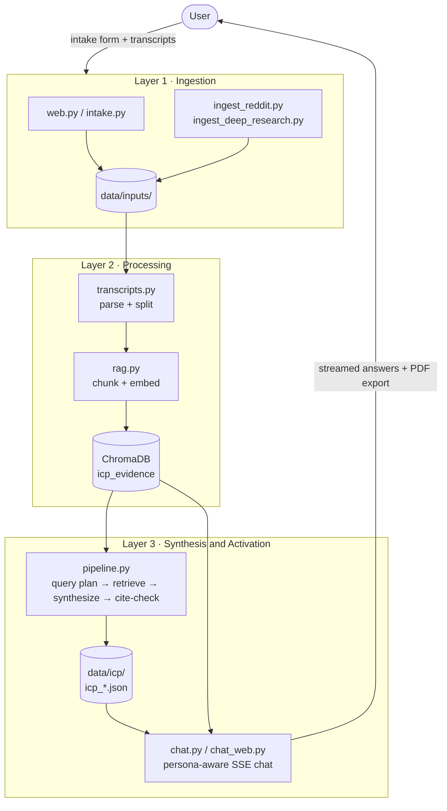

# Vera — ICP Agent

**Vera** (*veritas*, "truth") turns qualitative customer evidence into a structured, citation-grounded Ideal Customer Profile — then activates that ICP as a persona-aware chat assistant you can interview.

Feed it interview transcripts, Reddit threads, and deep-research PDFs. Get back an ICP document where **every claim carries a citation back to the chunk of evidence that produced it**, plus 3–5 sub-personas you can talk to, test messaging against, and export.

---

## Why it exists

Customer research dies in decks. Teams run 10 interviews, pull 40 quotes, write a persona slide, and then never use it again — and nobody can trace the persona back to what a customer actually said.

Vera makes the traceability structural. Claims that can't be grounded in retrieved evidence get rejected at generation time, not caught in review.

---

## What it does

| | |
|---|---|
| **Ingests** | Interview transcripts (`.txt` `.md` `.pdf` `.docx` `.vtt` `.srt`), Reddit CSVs, deep-research PDFs |
| **Indexes** | Section-aware chunking → OpenAI embeddings → a single trust-tagged ChromaDB collection |
| **Synthesizes** | Seven-section ICP (demographics, jobs-to-be-done, pains, gains, objections, vocabulary, watering holes) with inline citations |
| **Activates** | Streaming chat with any synthesized sub-persona; reacts to messaging and ad concepts; exports the conversation to PDF |

### Two ideas worth stealing

**Trust-weighted three-lane retrieval.** Every chunk is tagged with its source type and a trust weight — transcript `1.0`, deep research `0.8`, Reddit `0.6`. A query is embedded once and run against three filtered lanes, which are returned *separately* so the caller can reweight them. A single lookup returns customer testimony, analyst framing, and public complaints side by side, each carrying its own credibility.

**Citation guards.** After each section is generated, every cited `chunk_id` is validated against the evidence actually retrieved for that section. Hallucinated citations are rejected and the section is retried. Confidence is then re-graded deterministically (2+ transcript chunks → high; 1 transcript → medium; 2+ non-transcript → medium; else low) — the model doesn't get to grade its own work.

---

## Architecture

Three layers. **The boundary between them is the file system** — a layer is done when its output is on disk in a known place and a known shape. That's what makes the pipeline resumable, inspectable, and swappable one layer at a time.



Full write-up, including module-by-module responsibilities and the layer contracts: **[docs/ARCHITECTURE.md](docs/ARCHITECTURE.md)**.

An agentic orchestrator (`scripts/run_agent.py`) sits *on top* of these layers as a Claude tool-use loop — it inspects state, builds the index, runs synthesis, and hands off to the chat server in a single command.

---

## Stack

Python 3.11+ · Anthropic Claude (direct SDK, no orchestration framework) · OpenAI `text-embedding-3-small` · ChromaDB · Flask + Server-Sent Events · Pydantic

The orchestration is deliberately hand-rolled. Trust-weighted lanes, citation guards, persona-filtered retrieval, and divergence checks don't map cleanly onto off-the-shelf chains — wrapping them in one would have hidden the part that matters.

---

## Getting started

```bash
git clone https://github.com/meghanaRangarajan/OmniVera.git
cd OmniVera

python3 -m venv .venv && source .venv/bin/activate
pip install -e .

cp .env.example .env   # then fill in your keys
```

`.env` needs:

```
ANTHROPIC_API_KEY=      # synthesis, chat, query decomposition
OPENAI_API_KEY=         # embeddings
REDDIT_CLIENT_ID=       # optional — only for Reddit ingestion
REDDIT_CLIENT_SECRET=
REDDIT_USER_AGENT=
```

### Run it

```bash
python scripts/run_web_intake.py     # 1. submit an intake + upload transcripts
python scripts/build_index.py        # 2. parse, chunk, embed, index
python scripts/run_pipeline.py       # 3. synthesize the ICP
python scripts/run_chat_server.py    # 4. chat with the persona

# or, all of the above via the agentic orchestrator:
python scripts/run_agent.py
```

### Tests

```bash
pytest
```

External APIs are mocked throughout — the suite makes no network calls.

---

## Data

**This repo ships no research data.** Everything under `data/` is gitignored except directory placeholders. Bring your own transcripts, or use the synthetic **Garmin Roam** case study (a fictional sub-$300 Gen Z outdoor smartwatch) that the examples and fixtures are written against.

Real customer interviews are confidential by default. Keep them out of git.

---

## Status & roadmap

v1 is complete and running locally. Next up:

- Hosted multi-user deployment (Railway, Auth0 Google sign-in, Upstash Redis for session state)
- Managed vector store; explicit re-index triggers keyed on transcript hash
- Versioned prompt registry + an evals harness scoring claims against held-out transcript spans
- Manual-edit UI for ICP review and freeze

---

## Credits

Designed and built by **Meghana Rangarajan**. The core system design — the three-layer model, trust-weighted retrieval, citation validation, persona differentiation — is mine. Claude Code was used for boilerplate and plumbing.

## License

MIT — see [LICENSE](LICENSE).
